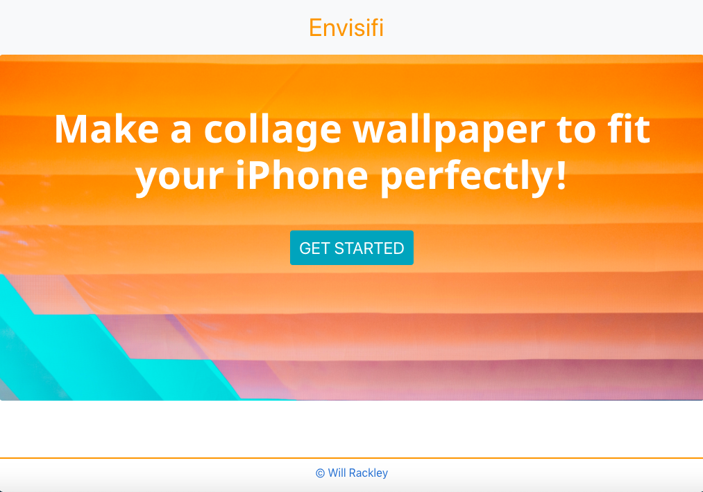
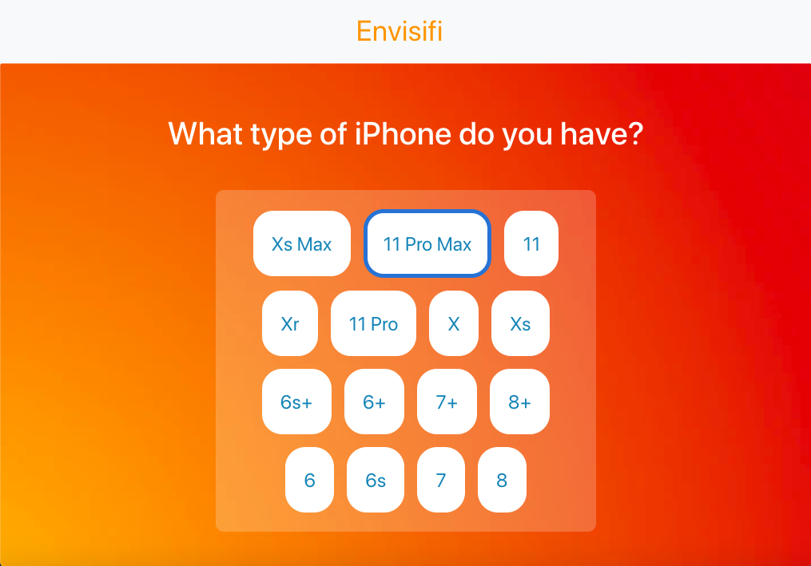
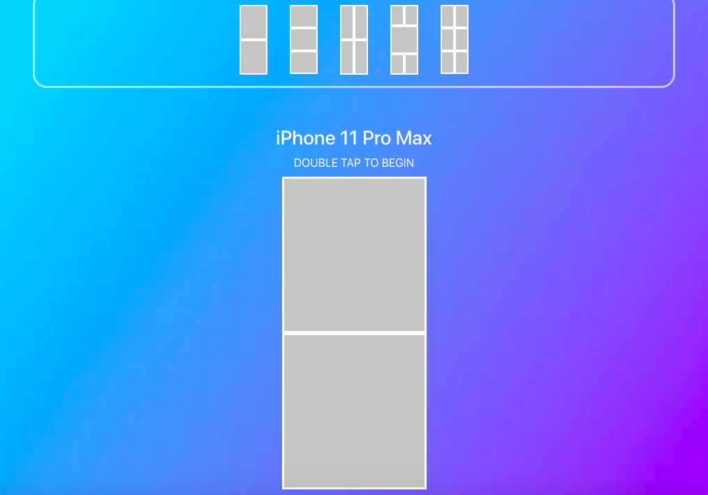
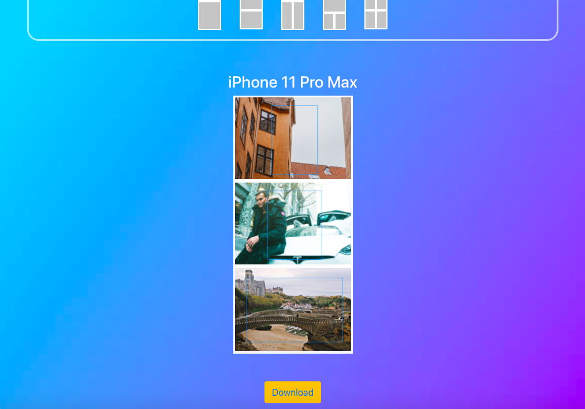

# Envisifi
*currently only available on desktop browsers* 

### Envisifi is a application that allows a user to make a collage from images they have stored on a device (desktop, laptop, ipad, mobile, etc) and set it to the exact dimensions for their iPhone, in order to serve as a wallpaper/lockscreen. 
---

---
### Choose the type of iPhone you want to create the collage for

---

### You then can choose from 6 different type of collage designs

---

### Once you choose the collage design, you can choose your images from your files and download the collage.

---

[Try it out by clicking here.](https://stormy-savannah-27633.herokuapp.com/ "Envisifi Homepage"

